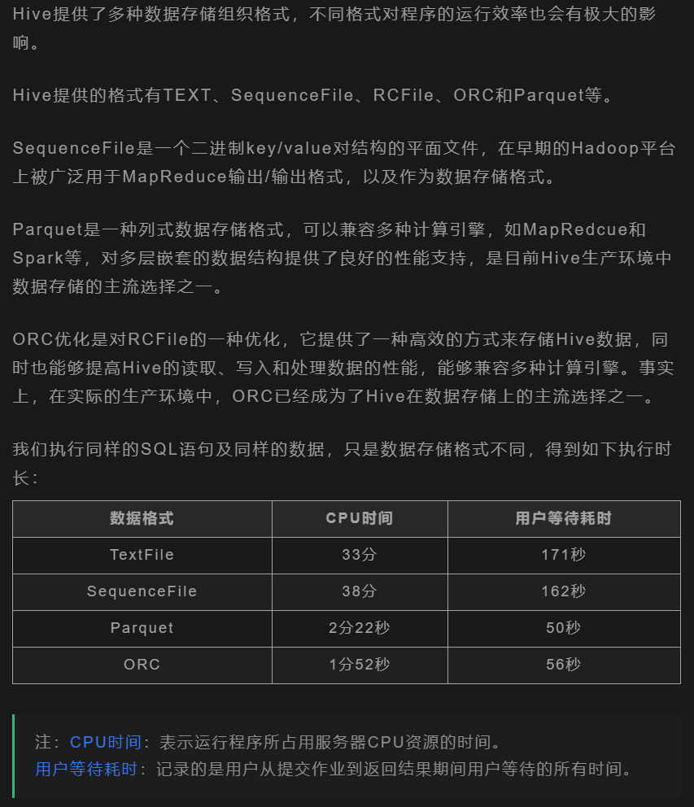
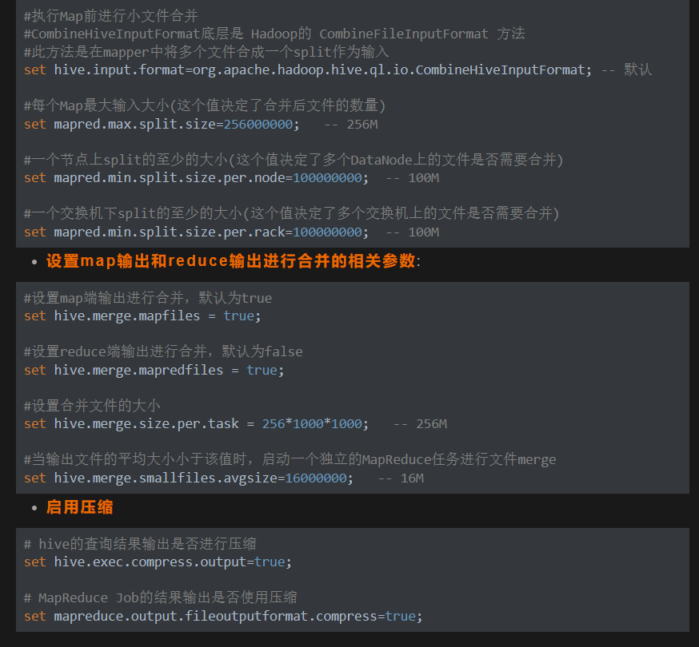

## Map Reduce 过程

map 就是将文件拆分为键值对的过程， reduce则是将键值对按照用户定义的逻辑输出结果

在map输出到reduce之间存在着大量处理过程，属于shuffle阶段，

map侧shuffle：map 输出不会直接输出到磁盘，每个map任务都会被分配一个缓存区，缓存区中的数据进行分区、排序、合并等操作，每当缓存容量快被占满时，就会启动溢写，将缓存的内容一次性写入磁盘，并清空缓存，每次溢写操作都会生成一个溢写文件，map任务结束前，会对所有溢写文件进行归并，生成一个大的溢写文件

reduce侧的shuffle：将前面的map输出结果按照分区发送到不同的reduce任务上，领取的数据也是先存到缓存区，然后溢写，最后归并

## Spark为什么比MR快

MR的shuffle阶段存在大量的磁盘读写操作，因此比较慢，而Spark针对此将中间过程放在了内存中，不一定写入磁盘，并支持将反复使用的数据缓存到内存中，减少加载耗时，DAG 相比MapReduce 在大多数情况下可以减少 shuffle 次数。

## 中台项目介绍

智慧会议跟政府部门业务对接，建立了一个数据中台，也有完整的数仓架构，从政府各部门抽取过来的数据暂存在ODS层，然后在DW层构建对应各个业务的主题表单，并将ODS层的数据进行ETL操作输送到相应主题表单里，ETL工具使用的是Kettle，最后ADS层对主题表单里的数据进行数据分析，进行可视化大屏展示。

## HDFS的优缺点

优点：

1. 海量数据存储： HDFS可横向扩展
2. 高容错性：节点丢失，系统依然可用，数据保存多个副本，副本丢失后自动恢复。
3. 大文件存储：HDFS采用数据块的方式存储数据，将一个大文件切分成多个小文件，分布存储。

缺点：

1. 不能做到低延迟数据访问： HDFS 针对一次性读取大量数据继续了优化，牺牲了延迟性。
2. 不适合大量的小文件存储 ：
   A:由于namenode将文件系统的元数据存储在内存中,因此该文件系统所能存储的文件总数受限于namenode的内存容量。
   B:每个文件、目录和数据块的存储信息大约占150字节。
   由于以上两个原因，所以导致HDFS不适合大量的小文件存储
3. 不适合写多读少
4. 不适合并发写入（因为创建副本怕导致冲突）
5. 不能在任意位置修改文件，只能追加修改

## 数据倾斜

原因一般来说就两个：

1. 任务中需要处理大量相同的key的数据
2. 任务读取不可分割的大文件

解决方案

1. 空值引发的数据倾斜

   方法一：直接不让null值参与join操作

   方法二：给null值随即赋值

2. 不同数据引发的数据倾斜，比如 a表join的字段key为int，b中key字段为string，hash操作按照int来，大量的string分配成同一个id，进入同一个reduce中，引发数据倾斜

   解决方法：join前将字段类型转换统一

3. 不可拆分大文件引发的数据倾斜，使用GZIP压缩等不支持文件分割操作

   解决方法：采用bzip和zip等支持文件分割的压缩算法

## Hive 调优

1. SQL语句优化
2. 数据格式优化，使用orc数据格式和snappy压缩策略可以降低IO读写降低传输量

3. 小文件过多优化

- 使用hive自带的concatenate命令
- map调参
- ..
- 减少reduce的数量
- 使用hadoop的archive将小文件归档

4. 并行执行调优，系统资源比较空闲的时候，打开hive的并行执行，job中并行阶段增多，那么集群利用率就会增加
5. jvm优化，可以在hive中设置jvm重用，使同一个JVM实例在同一个Job中重新使用n次

## Spark 调优

## 拉链表

为了避免类似于每日全量抽取等缓慢变化维历史状态反复冗余的数据，给数据表增添两个时间字段（start_time&end_time）用于记录历史状态。只同步当天修改的数据然后union all 历史表单

拉链表左连接新增数据，对不为null的数据进行 时间字段修改

## Hive 四大排序方法

1. sort by、order by、 distribute by、 group by 、cluster by区别

order by是将所有数据放在一个 reduce里面进行排序，当数据量大时，会出现内存溢出的问题，同时数据排序效率低。

## Hive 内外部表的区别，外部表的存在意义

未被 external 修饰的是内部表，被 external 修饰的为外部

内部表数据由Hive自身管理，外部表由HDFS管理

删除内部表会直接删除元数据（metadata）及存储数据；删除外部表仅仅会 删除元数据，HDFS 上的文件并不会被删除

当需要通过Hive完全管理控制表的整个生命周期时，请使用内部表。

当文件已经存在或位于远程位置时，请使用外部表，因为即使删除表，文件也会被保留。
